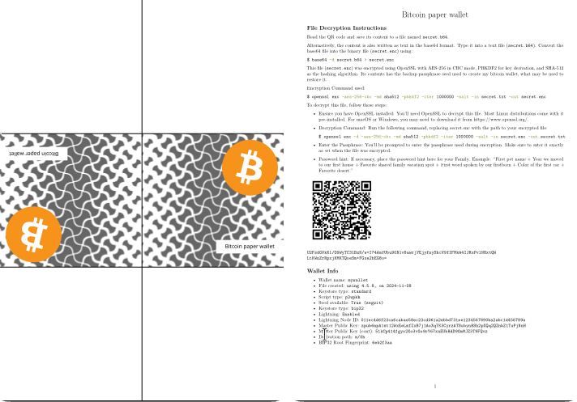

# paperwallet

This project aims to create a secure paper wallet by encrypting a cryptocurrency backup seed with AES. The seed can be accessed using a passphrase you define, either one your family could uncover or a private passphrase known only to you--allowing you to recover the seed with just the paper wallet and your memory. This ensures the seed is never stored in plain text, making it a secure legacy.

Create a AES encrypted bitcoin paper wallet from your seed phrase. If necessary, edit the `instructions.md` file to add additional instructions. Also edit `walletinfo.md` to add your wallet info.

Edit `secret` file and input your backup seed phrase, then run the `paperwallet.sh` script:

```bash
$ ./paperwallet.sh
```



To retrieve the backup seed open the PDF file to copy (screenshot) the QR code or use the webcam to capture the QR code on paper. 

For using a screenshot of the PDF file, do:

```bash
$ ./qrcode_decode.sh clipboard
```

For use the backup paper and your webcam, do:
```bash
$ ./qrcode_decode.sh webcam
```
